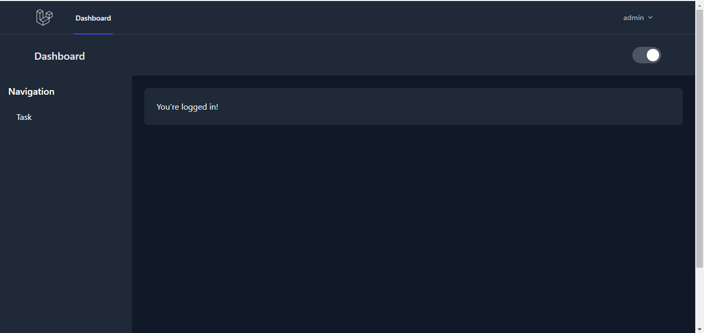
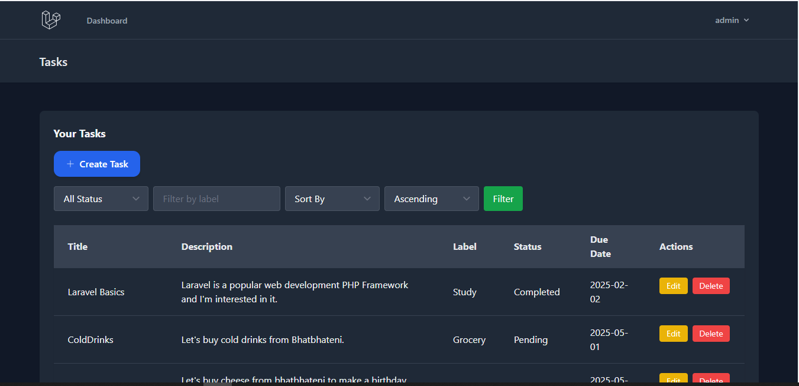

# ✨ Laravel Todo App ✨  
A simple yet powerful personal task manager built with Laravel 12

**Blade • Tailwind CSS • MySQL • Breeze**

---

## 🚀 Introduction  
Welcome to the **Laravel Todo App** – a clean and responsive task management system that helps you organize your life one task at a time. Built with Laravel 12 and Blade, this app lets users securely create, manage, and filter their tasks with ease.

---

## 🧰 Tech Stack
- 🧠 **Laravel 12** – Backend logic, routing, and database handling  
- 🧾 **Blade** – Templating engine for building beautiful UIs  
- 🎨 **Tailwind CSS** – Utility-first CSS for responsive design  
- 🐬 **MySQL** – Task and user data storage  
- 🔐 **Breeze** – Authentication scaffolding for user login and task ownership

---

## 🌟 Core Features
- ✅ Create, read, update, and delete tasks
- 🧍‍♂️ User-specific task ownership
- 🔍 Filter tasks by status and label
- ⏳ Sort tasks by due date,title,status,created_at
- 📱 Responsive layout for all devices

---

## 🧠 Challenges & Solutions

### 🔐 1. User Authentication & Task Ownership
**Challenge**: Users should only access their own tasks  
**Solution**:  
- Integrated **Laravel Breeze** for user auth  
- Used `Auth::id()` checks in all controller methods to ensure ownership

---

### 🗂️ 2. Task Filtering & Sorting  
**Challenge**: Dynamically filter tasks by status/label and sort by due date  
**Solution**:  
- Enhanced the `TaskController@index()` method to handle dynamic queries  
- Used query params + dropdowns in Blade to apply filters in real-time

---

### 🛡️ 3. Form Validation & Error Handling  
**Challenge**: Validate inputs and show helpful errors  
**Solution**:  
- Leveraged Laravel's request validation  
- Used `@error` in Blade to display inline form messages

---

### 📱 4. Responsive Design  
**Challenge**: UI needed to look great on mobile and desktop  
**Solution**:  
- Tailored UI using **Tailwind’s responsive utilities** like `sm`, `md`, `lg`  
- Optimized layout with flex and grid systems for smaller screens

---

### 📆 5. Sorting Tasks by Due Date  
**Challenge**: Allow users to sort tasks chronologically  
**Solution**:  
- Implemented dropdown selector for ascending/descending sorting  
- Updated query builder to reflect sort choice dynamically

---

### 🔄 6. Status Updates  
**Challenge**: Updating task status and reflecting it everywhere  
**Solution**:  
- Added dropdown in edit form for `Pending`, `In_Progress`, `Completed`  
- Synced status updates to DB and UI using Laravel’s form methods

---

## 📸 Screenshots

### 🖥️ Dashboard View  

### 📝 Task View  

---

## 🎥 Demo Video  
📺 [Watch the Demo](https://www.youtube.com/watch?v=Tu19XNcB73U)  
Get a full walkthrough of how the Todo app works!

---

## 💡 Conclusion  
Building this app sharpened my Laravel + Blade skills, improved my database handling, and gave me a solid grasp of responsive design with Tailwind. From task validation to smart filters and user-based task ownership, each feature was a step toward deeper understanding and cleaner code.

Made with ❤️ and Laravel.

---

## 📜 License  
© 2025 | MIT License
